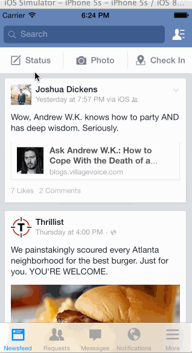

# Facebook Assignment

This is a demo application for Facebook mobile

Take 2 since my first attempt had a storyboard bug

Time spent: too long... 5 hours

Completed user stories:

 * [x] Required: 5 view controllers with scrollable views 
 * [x] Required: Thrillist story view 
 * [x] Required: Posting: Status, Photo, or Check in
 * [x] Optional: Like button shown towards end of walkthrough
 
Notes:

Spent some time making the UI work across multiple phone resolutions by playing around with the RelativeLayout.

Walkthrough of all user stories:

